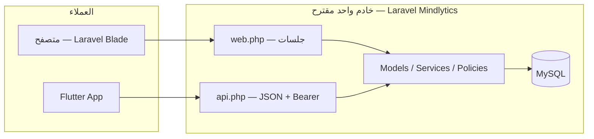

# بناء المنصة Mindlytics — ربط الويب والموبايل وطبقة API

## 1. رسم تخطيطي منطقي

- **نفس طبقة المجال** (`Domain`): يمنع تناقض القواعد بين الويب والتطبيق.
- **مسارات مختلفة للوسيط**: الويب يعتمد middleware الجلسة؛ الـ API يعتمد `auth:sanctum` أو ما يعادله.

## 2. فصل المسؤوليات

| القلق | الويب | الموبايل |
|--------|-------|-----------|
| حفظ الجلسة | Cookie + session id | Token في التخزين الآمن (Secure Storage) |
| CSRF | مطلوب على نماذج Blade | غير مستخدم؛ استخدم Bearer token |
| التنسيق | HTML redirects | JSON فقط (`Accept: application/json`) |

## 3. الإصدارات (Versioning)

استخدم بادئة ثابتة، مثل:

- `https://your-domain.com/api/v1/...`

يتيح إضافة `v2` لاحقًا دون كسر التطبيقات المنشورة.

## 4. ماذا يضع Flutter في الإعدادات

- **Base URL** لم يعد فقط للروابط الخارجية؛ يجب أن يشير لنفس خادم Laravel الذي يخدم `/api/v1`.
- متغير البناء في Flutter: `--dart-define=WEB_BASE_URL=...` — يمكن إضافة `API_BASE_URL` منفصل إذا احتجت مسارًا مختلفًا عن صفحات الويب العامة.

## 5. الأمان (ملخص)

- HTTPS في الإنتاج.
- تقييد CORS على أصول معروفة (تطبيق الويب إن وجد + لا حاجة عادةً لـ CORS لتطبيق Flutter الأصلي بنفس الدومين أو subdomain مخصص — يعتمد على طريقة النشر).
- Rate limiting على مسارات تسجيل الدخول (موجود جزئيًا على الويب؛ كرّره للـ API).
- عدم إرجاع تفاصيل خطأ حساسة في JSON في وضع الإنتاج.

## 6. الخطوة التالية

راجع `laravel-integration.md` في هذا المجلد لتفعيل المسارات والـ Sanctum داخل `Mindlytics`.
